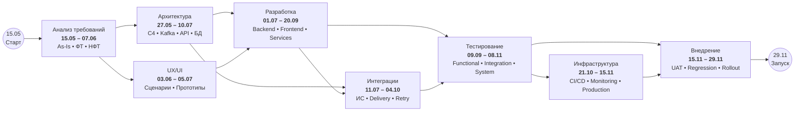
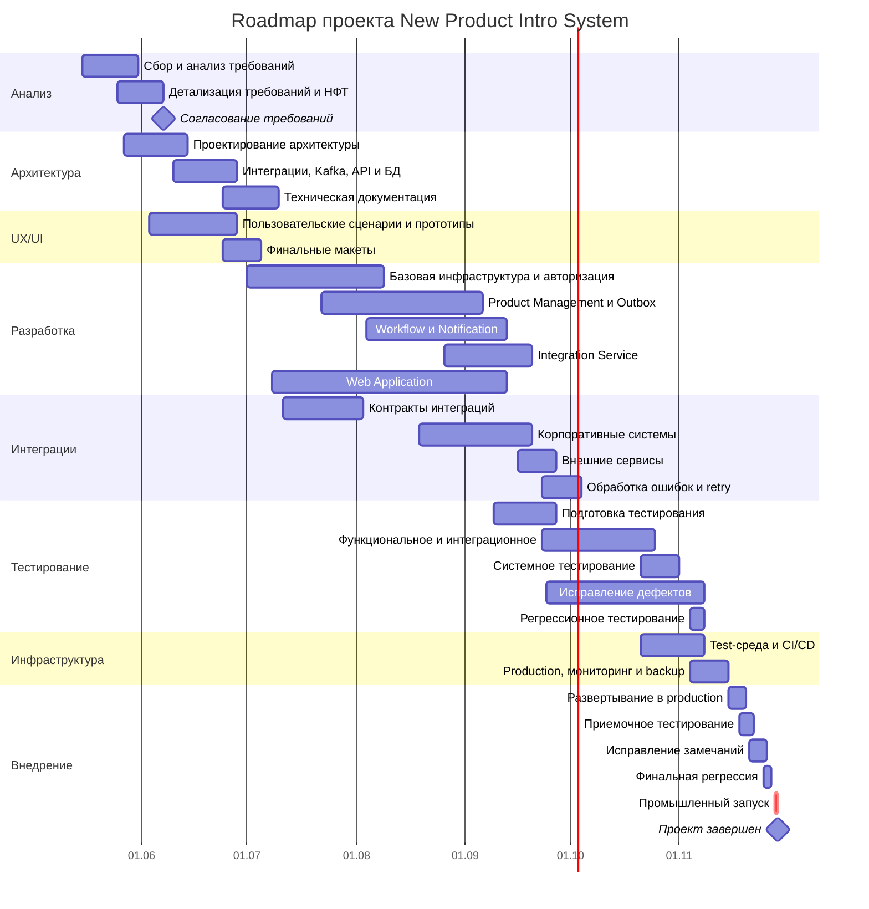

## 4. Roadmap проекта

### 4.1. Подход к планированию

План реализации New Product Intro System сформирован на основании детальной
декомпозиции проекта на задачи аналитики, архитектуры, разработки,
интеграций, тестирования и инфраструктуры.

Дата начала проекта — **15 мая 2026 года**.

Планирование предусматривает:

- подготовительный двухнедельный Sprint 0;
- последующую работу трёхнедельными спринтами;
- параллельное выполнение независимых работ;
- учёт зависимостей между аналитикой, архитектурой, разработкой и тестированием;
- раннее начало интеграционных и тестовых работ;
- отдельный этап стабилизации и подготовки промышленного запуска;
- временной резерв после реализации основного функционального объёма.

Плановая дата завершения проекта — **29 ноября 2026 года**.

> Первоначальная укрупнённая оценка сроков была пересмотрена после детальной
> проработки архитектуры и декомпозиции решения.
>
> Архитектурное проектирование показало необходимость реализации дополнительных
> технических механизмов, необходимых для выполнения требований к надёжности,
> интегрируемости, безопасности и наблюдаемости системы.
>
> В результате в план были детально включены работы по реализации отдельных
> микросервисов и их баз данных, событийного взаимодействия через Kafka,
> Transactional Outbox, Integration Service, механизмов повторной синхронизации,
> Workflow Service, Notification Service, авторизации, мониторинга,
> резервного копирования, тестирования и подготовки промышленной инфраструктуры.
>
> Поэтому увеличение календарного срока проекта является результатом
> последовательного уточнения оценки по мере снижения архитектурной
> неопределённости.

### 4.2. Спринтовая модель

В проекте используется подготовительный **Sprint 0**, после которого основная
работа выполняется трёхнедельными спринтами.

| Период | Даты | Основной фокус |
|---|---|---|
| **Sprint 0** | 15.05–28.05 | Инициация, анализ As-Is, сбор требований, подготовка бэклога |
| **Sprint 1** | 29.05–18.06 | Требования, НФТ, архитектура, начало проектирования |
| **Sprint 2** | 19.06–09.07 | Архитектура, API, Kafka, БД, UI и начало разработки |
| **Sprint 3** | 10.07–30.07 | Backend, Frontend, Workflow, Integration Service |
| **Sprint 4** | 31.07–20.08 | Backend, Frontend, интеграции, обработка событий |
| **Sprint 5** | 21.08–10.09 | Внешние интеграции и начало комплексного тестирования |
| **Sprint 6** | 11.09–01.10 | Системное тестирование, отказоустойчивость, исправление дефектов |
| **Sprint 7** | 02.10–22.10 | Регрессия, инфраструктура, CI/CD, подготовка production |
| **Sprint 8** | 23.10–12.11 | Приёмка, исправление замечаний, промышленный запуск и стабилизация |
| **Финальный резерв** | 13.11–29.11 | Резерв проекта, стабилизация и закрытие проекта |

Sprint 0 является подготовительным и используется для формирования исходной
структуры проекта и снятия первичной неопределённости.

Последующие спринты имеют продолжительность три недели. При этом работы разных
направлений могут пересекаться: завершение всей аналитики не является
обязательным условием для начала разработки уже проработанных компонентов,
а тестирование начинается до завершения разработки всего решения.

### 4.3. Основные этапы реализации

Детальный план проекта разделён на восемь крупных направлений работ.

| № | Этап | Основное содержание |
|---|---|---|
| 1 | **Анализ требований и подготовка** | Бизнес-требования, As-Is, функциональные требования, роли, интеграционные требования, НФТ, согласование |
| 2 | **Архитектура и техническое проектирование** | Архитектура сервисов, взаимодействия, Kafka, API Gateway, авторизация, БД, Integration Service, Outbox |
| 3 | **UX/UI проектирование** | Пользовательские сценарии и интерфейсы Web Application |
| 4 | **Разработка серверной части** | Product Management, Authorization, Workflow, Notification, Integration Service и связанные компоненты |
| 5 | **Разработка Web Application** | Пользовательский интерфейс, карточка блюда, согласования, статусы и уведомления |
| 6 | **Интеграции с внешними системами** | Заказы, склад, логистика, сайт и мобильное приложение, доставки, социальные сети |
| 7 | **Тестирование и стабилизация** | Функциональное, интеграционное, системное, регрессионное тестирование и исправление дефектов |
| 8 | **Инфраструктура и внедрение** | Среды, CI/CD, мониторинг, резервное копирование, production, приёмка и запуск |

### 4.4. Анализ требований и подготовка

На первом этапе формируется функциональная и нефункциональная основа решения.

Ключевые задачи:

| ID | Задача | Исполнитель |
|---|---|---|
| A1 | Сбор и анализ бизнес-требований | Комаров |
| A2 | Анализ текущего процесса ввода нового блюда | Петров |
| A3 | Формирование функциональных требований | Комаров |
| A4 | Описание ролей пользователей и сценариев работы | Иванов |
| A5 | Формирование требований к интеграциям | Иванов |
| A6 | Формирование требований к НФТ | Петров |
| A7 | Согласование требований с заказчиком | Комаров |

Работы аналитиков частично выполняются параллельно. Например, анализ
существующего процесса и сбор бизнес-требований начинаются одновременно,
после чего результаты используются для подготовки функциональных,
интеграционных и нефункциональных требований.

### 4.5. Архитектура и техническое проектирование

Архитектурные работы начинаются до полного завершения аналитического этапа.
Это позволяет раньше определить технические ограничения и снизить риски,
связанные с интеграциями и реализацией нефункциональных требований.

В рамках этапа выполняются:

- уточнение архитектуры системы;
- определение НФТ и архитектурных ограничений;
- проектирование взаимодействия сервисов;
- проектирование событийной модели;
- проектирование Apache Kafka;
- проектирование API Gateway и механизмов авторизации;
- проектирование отдельных БД микросервисов;
- проектирование Integration Service;
- проектирование хранения состояния интеграционных операций;
- проектирование Transactional Outbox;
- подготовка технической документации.

Ключевую роль на данном этапе выполняет архитектор решения Лебедев совместно
с системными аналитиками.

Результаты архитектурного проектирования являются входными данными для
разработки соответствующих компонентов.

### 4.6. Разработка серверной части

Backend-разработка декомпозирована по архитектурным компонентам системы.

В рамках этапа реализуются:

#### Базовая инфраструктура сервисов

- структура backend-приложений;
- API Gateway;
- взаимодействие с Kafka;
- инфраструктура баз данных.

#### Authorization Service

- Authorization Service;
- Auth DB;
- проверка полномочий пользователей.

#### Product Management Service

- Product Management Service;
- Product DB;
- Product API Controller;
- Product Service;
- Product Repository;
- операции создания и изменения карточки блюда.

#### Transactional Outbox

- хранение событий Outbox;
- Outbox Publisher;
- публикация событий изменения продукта в Kafka;
- контроль состояния публикации.

#### Workflow Service

- Workflow Service;
- Workflow DB;
- состояния жизненного цикла блюда;
- процессы согласования нового блюда.

#### Notification Service

- Notification Service;
- Notification DB;
- WebSocket-уведомления;
- доставка информации об изменениях пользователям.

#### Integration Service

- Integration Service;
- Integration DB;
- Integration Task Repository;
- Synchronization Worker;
- обработка ошибок;
- retry-механизмы;
- публикация событий результатов интеграций.

Разработка компонентов выполняется параллельно там, где это позволяют
архитектурные зависимости.

### 4.7. Разработка Web Application

Frontend-разработка выполняется параллельно с backend-разработкой.

В состав работ входят:

| ID | Задача |
|---|---|
| F1 | Создание структуры Web Application |
| F2 | Реализация авторизации пользователей |
| F3 | Экран создания нового блюда |
| F4 | Экран рецепта и ингредиентов |
| F5 | Экран согласования блюда |
| F6 | Отображение статусов внедрения |
| F7 | Интеграция Web Application с API Gateway |
| F8 | Интеграция отображения уведомлений |

Frontend-компоненты реализуются по мере готовности соответствующих API
и backend-компонентов.

### 4.8. Интеграции с внешними системами

Интеграционные работы выделены в самостоятельное направление в связи с
большим количеством внешних зависимостей.

Первоначально выполняется подготовка интеграционных контрактов, после чего
параллельно реализуются подключения к различным системам.

Основные задачи:

| ID | Интеграция |
|---|---|
| INT1 | Подготовка контрактов интеграций |
| INT2 | Система управления заказами |
| INT3 | Система управления складом |
| INT4 | Система управления логистикой |
| INT5 | Сайт и мобильное приложение |
| INT6 | Сервисы доставки |
| INT7 | Социальные сети |
| INT8 | Настройка обработки ошибок интеграций |
| INT9 | Проверка повторного запуска неуспешных интеграций |

Интеграции выполняются независимо друг от друга, что соответствует
архитектурному требованию: недоступность одной внешней системы не должна
блокировать передачу информации в остальные системы.

### 4.9. Тестирование и стабилизация

Тестирование начинается до полного завершения разработки.

Такой подход позволяет обнаруживать дефекты и проблемы интеграционного
взаимодействия на ранних этапах, а не переносить весь объём проверок
на конец проекта.

В рамках этапа предусмотрены:

| ID | Задача |
|---|---|
| T1 | Подготовка стратегии тестирования |
| T2 | Подготовка тестовых сценариев |
| T3 | Тестирование авторизации |
| T4 | Тестирование создания нового блюда |
| T5 | Тестирование Kafka и Outbox |
| T6 | Тестирование Workflow |
| T7 | Тестирование Notification Service |
| T8 | Интеграционное тестирование Web Application |
| T9 | Тестирование внешних интеграций |
| T10 | Тестирование отказоустойчивости и retry |
| T11 | Системное тестирование |
| T12 | Исправление дефектов |
| T13 | Регрессионное тестирование |

Особое внимание уделяется проверке архитектурно значимых сценариев:

- корректности публикации событий;
- отсутствию потери данных;
- восстановлению после временной недоступности внешних систем;
- повторному выполнению неуспешных интеграций;
- независимости интеграций;
- корректности авторизации;
- прохождению полного жизненного цикла нового блюда.

### 4.10. Инфраструктура и внедрение

Финальный технический этап включает подготовку инфраструктуры и ввод решения
в промышленную эксплуатацию.

Основные задачи:

| ID | Задача | Исполнитель |
|---|---|---|
| DEP1 | Подготовка тестового окружения | Орлов |
| DEP2 | Настройка CI/CD | Орлов |
| DEP3 | Подготовка production-окружения | Орлов |
| DEP4 | Настройка мониторинга и логирования | Орлов |
| DEP5 | Настройка резервного копирования БД | Захарова / Орлов |
| DEP6 | Развертывание системы в production | Орлов |
| DEP7 | Приемочное тестирование | Комаров / Иванов / Волкова |
| DEP8 | Исправление замечаний приемочного тестирования | Ким / Соколов / Морозов |
| DEP9 | Финальная регрессия | Волкова |
| DEP10 | Подготовка документации и инструкций | Петров |
| DEP11 | Запуск системы в промышленную эксплуатацию | Лебедев / Орлов |

В соответствии с детальным планом основной объём реализации завершается
промышленным развертыванием, приёмочным тестированием, устранением замечаний,
финальной регрессией и запуском системы.

Период до 29 ноября используется как проектный резерв для стабилизации
решения и закрытия проекта.

### 4.11. Roadmap проекта

Roadmap отражает основные этапы реализации **New Product Intro System**, их последовательность и частичное параллельное выполнение.

### 4.12. Диаграмма Ганта

Диаграмма Ганта проекта представлен в укрупнённом виде для отображения основных
этапов, параллельности работ и ключевых зависимостей.

Детальный план проекта декомпозирован до отдельных задач аналитики,
архитектуры, разработки, тестирования и инфраструктуры. На диаграмме
связанные задачи объединены в функциональные группы для повышения
читаемости.

Плановый период реализации проекта: **15.05.2026–29.11.2026**.

