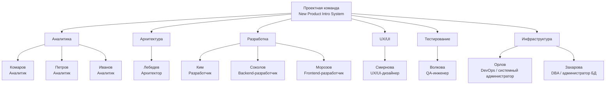

## 5. Команда проекта

### 5.1. Принцип формирования команды

Для реализации **New Product Intro System** используется кросс-функциональная проектная команда, включающая представителей бизнеса, аналитики, архитектуры, разработки, тестирования и эксплуатации.

Состав команды сформирован с учётом основных направлений проекта:

- сбор и анализ бизнес-требований;
- системный анализ;
- архитектурное проектирование;
- UX/UI-проектирование;
- backend-разработка;
- frontend-разработка;
- разработка интеграций;
- тестирование;
- подготовка инфраструктуры;
- администрирование баз данных;
- внедрение и сопровождение решения.

Такой состав позволяет выполнять часть работ параллельно и привлекать специалистов соответствующего профиля на разных этапах жизненного цикла проекта.

### 5.2. Организационная структура проектной команды

Проект реализуется кросс-функциональной командой, включающей аналитиков,
архитектора, разработчиков, UX/UI-дизайнера, QA-инженера и специалистов,
отвечающих за инфраструктуру и базы данных.

### 5.3. Состав проектной команды

| Участник / роль | Основная зона ответственности |
|---|---|
| **Спонсор проекта / руководство** | Стратегическая поддержка проекта, принятие ключевых управленческих решений, обеспечение необходимых ресурсов |
| **Product Owner / бизнес-заказчик** | Определение бизнес-целей, формирование и приоритизация требований, согласование результатов |
| **Project Manager** | Планирование проекта, контроль сроков, ресурсов, зависимостей и рисков |
| **Lead System Analyst** | Координация аналитического направления, распределение задач аналитиков, контроль качества аналитических артефактов |
| **Иванов — Senior System Analyst** | Проработка наиболее сложных интеграционных требований и архитектурных взаимодействий |
| **Комаров — Middle System Analyst / Business Analyst** | Сбор и детализация бизнес- и функциональных требований, проработка пользовательских сценариев и взаимодействия frontend/backend |
| **Петров — Middle System Analyst** | Анализ As-Is, описание бизнес-процессов, НФТ, проектная и пользовательская документация |
| **Лебедев — Solution Architect** | Проектирование архитектуры решения, взаимодействия сервисов, Kafka, API, хранилищ и интеграционных механизмов |
| **Backend-разработчики** | Реализация серверной части New Product Intro System и бизнес-сервисов |
| **Frontend-разработчик** | Реализация Web Application и интеграция пользовательского интерфейса с backend API |
| **QA-инженер** | Подготовка тестовых сценариев, функциональное, интеграционное, системное и регрессионное тестирование |
| **DevOps-инженер** | Подготовка сред, CI/CD, мониторинг, логирование и промышленное развертывание |
| **DBA** | Поддержка инфраструктуры баз данных, настройка резервного копирования и эксплуатационных механизмов |
| **Бизнес-эксперты** | Предоставление предметной экспертизы, согласование требований и участие в приёмке |

---

### 5.4. Команда системного анализа

Аналитический контур проекта включает Lead System Analyst, одного Senior System Analyst и двух Middle System Analysts.

Задачи распределяются между аналитиками с учётом уровня специалиста и его основной зоны компетенций.

#### Иванов — Senior System Analyst

Основная специализация — сложные интеграционные и архитектурные задачи.

В рамках проекта отвечает за:

- описание ролей пользователей и сценариев работы;
- формирование требований к интеграциям;
- проработку взаимодействия New Product Intro System с внешними системами;
- участие в проектировании API;
- участие в согласовании интеграционных контрактов;
- участие в архитектурной проработке решения;
- участие в приёмочном тестировании.

Senior SA привлекается к задачам с высокой интеграционной и технической сложностью.

#### Комаров — Middle System Analyst / Business Analyst

Основная специализация — бизнес- и функциональные требования, пользовательские сценарии и взаимодействие frontend/backend.

В рамках проекта отвечает за:

- сбор и анализ бизнес-требований;
- формирование функциональных требований;
- детализацию пользовательских сценариев;
- описание взаимодействия Web Application и backend-компонентов;
- согласование требований с заказчиком;
- участие в приёмочном тестировании.

Комаров выполняет роль связующего звена между бизнес-требованиями и их дальнейшей технической реализацией.

#### Петров — Middle System Analyst

Основная специализация — бизнес-процессы, требования и документация.

В рамках проекта отвечает за:

- анализ существующего процесса As-Is;
- описание бизнес-процессов;
- формирование и документирование нефункциональных требований;
- структурирование аналитических артефактов;
- подготовку проектной документации;
- подготовку пользовательских инструкций.

Такое распределение позволяет параллельно вести бизнес-анализ, системный анализ, интеграционную проработку и подготовку документации без концентрации всех аналитических задач у одного специалиста.

---

### 5.5. Архитектура

За архитектурное направление отвечает **Solution Architect — Лебедев**.

Основные зоны ответственности архитектора:

- определение общей архитектуры New Product Intro System;
- декомпозиция решения на сервисы;
- проектирование взаимодействия компонентов;
- выбор синхронных и асинхронных механизмов взаимодействия;
- проектирование событийного взаимодействия через Apache Kafka;
- проектирование API Gateway;
- проектирование подхода к авторизации;
- определение границ ответственности микросервисов;
- определение стратегии хранения данных;
- проектирование Integration Service;
- проектирование Outbox;
- обеспечение выполнения архитектурно значимых НФТ;
- участие в подготовке решения к промышленному запуску.

Архитектор взаимодействует с системными аналитиками, разработчиками, QA и специалистами эксплуатации на протяжении всего проекта.

---

### 5.6. Команда разработки

Команда разработки разделена на backend- и frontend-направления.

#### Backend-разработка

Backend-разработчики реализуют серверную часть системы, включая:

- API Gateway;
- Authorization Service;
- Product Management Service;
- Product DB;
- Outbox;
- Outbox Publisher;
- Workflow Service;
- Notification Service;
- Integration Service;
- Synchronization Worker;
- механизмы retry;
- взаимодействие с Apache Kafka;
- интеграционные адаптеры.

Работы распределяются между разработчиками таким образом, чтобы независимые сервисы могли разрабатываться параллельно.

#### Frontend-разработка

Frontend-разработчик отвечает за реализацию Web Application.

Основные задачи:

- авторизация пользователя;
- интерфейс создания нового блюда;
- работа с рецептурой и ингредиентами;
- интерфейс согласования;
- отображение статусов;
- интеграция с API Gateway;
- отображение пользовательских уведомлений.

Frontend-разработка выполняется параллельно с backend-разработкой по мере готовности API и соответствующих контрактов взаимодействия.

---

### 5.7. Тестирование

QA-инженер отвечает за контроль качества решения на протяжении разработки.

Основные зоны ответственности:

- подготовка стратегии тестирования;
- подготовка тестовых сценариев;
- функциональное тестирование;
- тестирование авторизации;
- тестирование создания и изменения карточки блюда;
- проверка Kafka и Outbox;
- тестирование Workflow Service;
- тестирование Notification Service;
- интеграционное тестирование Web Application;
- тестирование внешних интеграций;
- проверка механизмов retry;
- тестирование отказоустойчивости;
- системное тестирование;
- регрессионное тестирование;
- участие в приёмочном тестировании.

QA подключается к проекту до полного завершения разработки, что позволяет выявлять дефекты и интеграционные проблемы на ранних этапах.

---

### 5.8. Эксплуатация и инфраструктура

За инфраструктурное направление отвечают DevOps-инженер и DBA.

#### DevOps-инженер

Основные задачи:

- подготовка тестового окружения;
- настройка CI/CD;
- подготовка production-окружения;
- настройка мониторинга;
- настройка логирования;
- участие в настройке резервного копирования;
- развертывание решения;
- участие в промышленном запуске.

#### DBA

Основные задачи:

- поддержка инфраструктуры баз данных;
- участие в настройке хранилищ микросервисов;
- настройка резервного копирования;
- контроль эксплуатационной готовности баз данных.

DevOps и DBA взаимодействуют с архитектором и разработчиками для обеспечения эксплуатационной готовности решения.

---

### 5.9. Бизнес-эксперты

В проекте участвуют представители подразделений, непосредственно задействованных в процессе внедрения нового блюда.

К основным бизнес-экспертам относятся:

- маркетолог;
- технолог;
- шеф-повар;
- представители закупок;
- представители логистики;
- представители производства;
- представители ценообразования;
- представители других смежных подразделений.

Бизнес-эксперты:

- предоставляют информацию о текущем процессе;
- участвуют в формировании требований;
- согласовывают целевой процесс;
- проверяют соответствие решения бизнес-потребностям;
- участвуют в демонстрациях;
- предоставляют обратную связь;
- участвуют в приёмке реализованного решения.

---

### 5.10. Взаимодействие участников проекта

Работа команды организована в соответствии с выбранным подходом **Scrum с элементами Kanban**.

Для координации используются:

- единый Product Backlog;
- спринтовое планирование;
- трёхнедельные спринты после Sprint 0;
- Daily Meeting;
- Demo;
- ретроспективы;
- Kanban-доска;
- WIP-лимиты;
- регулярный контроль статуса проекта.

Основной workflow задач:

**Backlog → Todo → Analysis → Ready for Development → Development → Ready for Testing → Testing → Done → Demo.**

Каждая задача имеет:

- ответственного;
- статус;
- приоритет;
- оценку;
- связь с соответствующим этапом проекта;
- зависимости от других задач при их наличии.

Это позволяет контролировать движение задач между аналитикой, разработкой и тестированием и своевременно выявлять возникающие блокировки.

---

### 5.11. Распределение ответственности

На уровне ключевых этапов ответственность распределяется следующим образом:

| Этап | Основная ответственность | Участники |
|---|---|---|
| **Бизнес-требования** | Product Owner, аналитики | Бизнес-эксперты |
| **Системные требования** | Lead SA / SA | Архитектор, разработка |
| **Архитектура** | Solution Architect | Senior SA, Lead SA, DevOps |
| **UX/UI** | UX/UI | Аналитики, Product Owner |
| **Backend** | Backend-команда | Архитектор, аналитики |
| **Frontend** | Frontend-разработчик | Аналитики, Backend |
| **Интеграции** | Backend / Integration | Senior SA, архитектор |
| **Тестирование** | QA | Аналитики, разработчики |
| **Инфраструктура** | DevOps / DBA | Архитектор, разработчики |
| **Приёмка** | Product Owner | Бизнес-эксперты, SA, QA |
| **Промышленный запуск** | DevOps / Solution Architect | Разработка, QA, аналитики |

---

### 5.12. Принцип распределения ресурсов

Ресурсы проекта распределяются с учётом специализации сотрудников и возможности параллельного выполнения независимых задач.

Наиболее сложные архитектурные и интеграционные задачи передаются Senior System Analyst и Solution Architect. Функциональные и пользовательские сценарии распределяются между Middle System Analysts в соответствии с их специализацией.

Разработка декомпозирована по отдельным сервисам и компонентам, что позволяет выполнять независимые задачи параллельно.

QA подключается до завершения всего объёма разработки, а DevOps — до начала финального этапа внедрения.

Такое распределение позволяет:

- снизить риск перегрузки отдельных специалистов;
- сократить количество последовательных работ;
- раньше начинать тестирование;
- параллельно реализовывать независимые компоненты;
- снизить влияние отдельных специалистов на критический путь проекта;
- обеспечить участие необходимых компетенций на каждом этапе реализации.