## 6. Риски проекта

### 6.1. Подход к управлению рисками

Управление рисками является непрерывной частью процесса реализации
**New Product Intro System**.

Для каждого выявленного риска оцениваются:

- вероятность возникновения;
- влияние на проект;
- возможные последствия;
- меры предупреждения и реагирования.

Риски регулярно пересматриваются в ходе реализации проекта. При изменении
вероятности или влияния риска его приоритет и набор мероприятий могут быть
скорректированы.

Основное внимание уделяется рискам, способным повлиять на:

- сроки реализации проекта;
- доступность необходимых ресурсов;
- объём проекта;
- качество требований;
- интеграционное взаимодействие;
- готовность инфраструктуры;
- принятие решения пользователями;
- успешность промышленного запуска.

Для систематизации рисков используется **RBS (Risk Breakdown Structure)**,
а для определения приоритетов — матрица **«Вероятность × Влияние»**.

---

### 6.2. Реестр рисков проекта

В рамках проекта определены следующие ключевые риски:

| ID | Риск | Вероятность | Последствие | Меры управления |
|---|---|---|---|---|
| **R1** | Задержка согласования требований | Высокая | Сдвиг сроков на 1–2 спринта | Определение владельцев требований, регулярные согласования и Demo |
| **R2** | Ограниченность ресурсов разработки | Высокая | Перенос части объёма работ и увеличение сроков | Приоритизация задач, контроль загрузки и резерв |
| **R3** | Сложность интеграций с информационными системами | Средняя | Рост сроков реализации и количества дефектов | Ранняя проработка контрактов и интеграционное тестирование |
| **R4** | Неконтролируемое расширение границ проекта | Средняя | Размывание MVP, рост трудозатрат и сроков | Change Control и оценка влияния изменений |
| **R5** | Низкое качество исходных данных | Средняя | Переделка требований и реализованной функциональности | Стандартизация карточки продукта и контроль качества данных |
| **R6** | Сопротивление изменениям | Низкая | Низкое принятие и использование решения пользователями | Обучение пользователей и коммуникации |
| **R7** | Недостаточность тестовых сред | Средняя | Задержка тестирования и последующих этапов | Заблаговременная подготовка тестовых сред |
| **R8** | Зависимость от смежных подразделений | Средняя | Блокировка отдельных работ и смещение сроков | Планирование и управление межкомандными зависимостями |
| **R9** | Ошибки rollout при запуске решения в рабочей среде | Средняя | Задержка или срыв промышленного запуска | Пилотный запуск, поэтапное развертывание и наличие плана отката |

К наиболее критичным рискам проекта относятся **R1, R2 и R3**.

Основной фокус управления данными рисками:

- раннее согласование требований;
- контроль доступности и загрузки ресурсов;
- ранняя проработка интеграций;
- проведение интеграционных проверок до завершения всей разработки.

---

### 6.3. R1 — задержка согласования требований

**Вероятность:** высокая.

Процесс внедрения нового блюда затрагивает большое количество подразделений
компании. Требования могут требовать согласования с представителями маркетинга,
технологами, производством, логистикой, закупками и другими участниками.

Если необходимые решения не будут приниматься своевременно, связанные задачи
аналитики, разработки и тестирования могут быть заблокированы.

**Возможные последствия:**

- задержка начала разработки;
- блокировка зависимых задач;
- увеличение количества повторных согласований;
- смещение календарного плана на 1–2 спринта.

**Меры управления:**

- назначение владельца для каждого значимого требования;
- раннее привлечение необходимых бизнес-экспертов;
- фиксация результатов согласований;
- регулярные Demo с заказчиком;
- своевременная эскалация вопросов, блокирующих дальнейшие работы.

---

### 6.4. R2 — ограниченность ресурсов разработки

**Вероятность:** высокая.

Специалисты проекта могут одновременно участвовать в других инициативах
компании. Кроме того, отдельные этапы требуют участия специалистов
определённого профиля, что создаёт риск появления ресурсных ограничений.

**Возможные последствия:**

- перенос отдельных задач;
- увеличение длительности критического пути;
- перенос части функциональности;
- увеличение общего срока проекта.

**Меры управления:**

- приоритизация задач;
- планирование загрузки участников команды;
- контроль критического пути;
- параллельное выполнение независимых работ;
- использование временного резерва;
- перенос менее приоритетной функциональности при возникновении критического
  дефицита ресурсов.

---

### 6.5. R3 — сложность интеграций с информационными системами

**Вероятность:** средняя.

New Product Intro System взаимодействует с большим количеством корпоративных
и внешних информационных систем.

Различия в интерфейсах, форматах данных, доступности сред и поведении внешних
систем могут увеличивать сложность реализации интеграций.

**Возможные последствия:**

- увеличение сроков разработки;
- рост количества интеграционных дефектов;
- необходимость изменения интеграционных контрактов;
- задержка комплексного тестирования;
- влияние на сроки промышленного запуска.

**Меры управления:**

- ранняя проработка интеграционных требований;
- подготовка и согласование интеграционных контрактов до начала реализации;
- раннее интеграционное тестирование;
- независимая проверка отдельных интеграций;
- тестирование обработки ошибок;
- проверка механизмов повторной синхронизации.

---

### 6.6. R4 — неконтролируемое расширение границ проекта

**Вероятность:** средняя.

В процессе реализации могут появляться новые требования и пожелания
стейкхолдеров, изначально не входившие в согласованный объём проекта.

Неконтролируемое включение таких требований приводит к **размыванию MVP**:
граница минимально необходимого объёма функциональности становится
неопределённой, а команда постоянно добавляет новые функции до завершения
базового решения.

**Возможные последствия:**

- увеличение объёма работ;
- увеличение трудозатрат;
- рост стоимости;
- смещение сроков;
- снижение фокуса команды на ключевых бизнес-целях.

**Меры управления:**

Для изменений применяется процесс **Change Control**.

Каждое существенное изменение должно быть:

1. зафиксировано инициатором;
2. описано с указанием причины и ожидаемой бизнес-ценности;
3. оценено командой с точки зрения влияния на сроки, трудозатраты, стоимость
   и риски;
4. рассмотрено Product Owner;
5. принято в текущий объём, перенесено на следующий релиз либо отклонено.

Таким образом, изменение требований допускается, но не должно происходить
неконтролируемо.

---

### 6.7. R5 — низкое качество исходных данных

**Вероятность:** средняя.

Процесс автоматизации зависит от корректности информации о новом блюде,
рецептуре, ингредиентах и связанных бизнес-параметрах.

Неполные, противоречивые или некорректные исходные данные могут привести
к ошибкам на последующих этапах процесса.

**Возможные последствия:**

- повторная аналитическая проработка;
- изменение требований;
- необходимость исправления реализованной функциональности;
- ошибки при передаче информации во внешние системы.

**Меры управления:**

- использование стандартизированной карточки нового блюда;
- определение обязательных полей;
- валидация вводимых данных;
- контроль качества данных (QC);
- согласование ключевой информации до запуска зависимых процессов.

---

### 6.8. R6 — сопротивление изменениям

**Вероятность:** низкая.

Внедрение New Product Intro System изменяет существующий процесс работы.
Часть ручных коммуникаций и личных договорённостей заменяется формализованным
цифровым workflow.

Пользователи могут продолжать использовать привычные способы взаимодействия
вместо новой системы.

**Возможные последствия:**

- низкое принятие решения пользователями;
- частичное использование системы;
- сохранение параллельных ручных процессов;
- невозможность получить ожидаемый эффект от автоматизации.

**Меры управления:**

- информирование пользователей об изменениях;
- привлечение бизнес-пользователей к согласованию решения;
- демонстрация функциональности в ходе разработки;
- подготовка пользовательской документации;
- обучение пользователей перед промышленным запуском.

---

### 6.9. R7 — недостаточность тестовых сред

**Вероятность:** средняя.

Для проверки решения необходимы тестовые среды как самой New Product Intro
System, так и связанных информационных систем.

Отсутствие или несвоевременная готовность необходимых сред может заблокировать
интеграционное и системное тестирование.

**Возможные последствия:**

- задержка QA;
- невозможность своевременно проверить интеграции;
- перенос системного тестирования;
- смещение даты промышленного запуска.

**Меры управления:**

- определение требований к средам на раннем этапе;
- подготовка тестовой инфраструктуры заранее;
- контроль доступности внешних тестовых контуров;
- раннее взаимодействие с владельцами смежных систем.

---

### 6.10. R8 — зависимость от смежных подразделений

**Вероятность:** средняя.

Реализация проекта требует участия подразделений и команд, которые не входят
непосредственно в основную проектную команду.

Например, их участие может потребоваться для:

- согласования требований;
- предоставления интеграционных контрактов;
- настройки доступов;
- подготовки тестовых данных;
- предоставления тестовых сред;
- проведения приёмки.

**Возможные последствия:**

- блокировка отдельных задач;
- нарушение зависимостей Roadmap;
- смещение критического пути;
- увеличение общего срока реализации.

**Меры управления:**

- фиксация межкомандных зависимостей в плане проекта;
- определение ответственных со стороны смежных подразделений;
- контроль сроков предоставления необходимых результатов;
- регулярный мониторинг блокирующих зависимостей;
- эскалация критических задержек.

---

### 6.11. R9 — ошибки rollout

**Вероятность:** средняя.

Даже после успешного прохождения тестирования при развертывании решения
в промышленной среде могут возникнуть проблемы, связанные с конфигурацией,
инфраструктурой, интеграциями или различиями между тестовой и промышленной
средами.

**Возможные последствия:**

- задержка промышленного запуска;
- частичная недоступность функциональности;
- ошибки интеграций;
- необходимость экстренного исправления;
- откат новой версии;
- срыв запланированной даты запуска.

**Меры управления:**

- предварительная проверка production-конфигурации;
- пилотный запуск;
- поэтапное развертывание;
- мониторинг состояния системы во время rollout;
- проведение smoke-проверок после развертывания;
- наличие заранее подготовленного плана отката;
- возможность восстановления предыдущей стабильной версии.

---
### 6.12. Матрица рисков

Для определения приоритетов рисков используется матрица
**«Вероятность × Влияние»**.

### 6.13. Risk Breakdown Structure (RBS)

Для систематизации рисков используется **Risk Breakdown Structure**.

Проектные риски разделены на шесть основных категорий:

```mermaid
flowchart TB

    ROOT["Риски проекта"]

    A["Управление<br/>и scope"]
    B["Процессы<br/>и требования"]
    C["Технологии<br/>и интеграции"]
    D["Ресурсы<br/>и сроки"]
    E["Люди<br/>и изменения"]
    F["Операционный<br/>запуск"]

    ROOT --> A
    ROOT --> B
    ROOT --> C
    ROOT --> D
    ROOT --> E
    ROOT --> F

    A --> A1["Рост требований"]
    A --> A2["Нечёткие приоритеты"]
    A --> A3["Слабый Change Control"]

    B --> B1["Задержка согласований"]
    B --> B2["Неполные требования"]
    B --> B3["Низкое качество данных"]

    C --> C1["Сложные интерфейсы"]
    C --> C2["Legacy-ограничения"]
    C --> C3["Нестабильные среды"]

    D --> D1["Перегрузка специалистов"]
    D --> D2["Занятость в других проектах"]
    D --> D3["Смещение критического пути"]

    E --> E1["Сопротивление пользователей"]
    E --> E2["Недостаточное обучение"]
    E --> E3["Низкая вовлечённость"]

    F --> F1["Задержка поставщиков"]
    F --> F2["Ошибки rollout"]
    F --> F3["Несвоевременная приёмка"]
```

RBS позволяет контролировать не только отдельные риски, но и источники
проектной неопределённости.

Если наблюдается увеличение рисков определённой категории, команда может
применять меры на уровне всей группы.

Например:

- рост рисков категории **«Ресурсы и сроки»** является основанием для
  пересмотра загрузки команды и критического пути;
- рост рисков категории **«Технологии и интеграции»** требует усиления
  технических и интеграционных проверок;
- рост рисков категории **«Процессы и требования»** требует дополнительного
  контроля согласований и качества требований;
- рост рисков категории **«Операционный запуск»** требует пересмотра
  готовности production-среды, плана rollout и rollback.

---

### 6.14. Мониторинг рисков

Реестр рисков не является статическим документом и пересматривается
на протяжении всего проекта.

Контроль рисков выполняется в рамках регулярных проектных активностей.

На еженедельном статусе проекта анализируются:

- новые выявленные риски;
- изменение вероятности существующих рисков;
- изменение потенциального влияния;
- статус мероприятий по снижению рисков;
- риски, которые уже реализовались и стали проблемами;
- влияние рисков на критический путь;
- необходимость управленческой эскалации.

Для каждого значимого риска должен быть определён ответственный за контроль
его состояния и выполнение мероприятий реагирования.

При реализации риска команда оценивает его фактическое влияние на:

- сроки;
- объём проекта;
- трудозатраты;
- ресурсы;
- качество;
- стоимость.

После этого принимается решение о необходимых корректирующих действиях.

---

### 6.15. Связь рисков с Roadmap

Риски учитываются при управлении календарным планом проекта.

Особое внимание уделяется рискам, способным повлиять на критический путь:

- **R1** может задержать переход от требований к реализации;
- **R2** может увеличить длительность разработки;
- **R3** может увеличить продолжительность интеграционных работ и тестирования;
- **R7** может задержать начало или завершение QA;
- **R8** может блокировать работы, зависящие от внешних команд;
- **R9** непосредственно влияет на финальный этап внедрения.

Поэтому в Roadmap используется параллельное выполнение независимых задач,
раннее начало интеграционного тестирования и контроль зависимостей между
командами.

Актуальный план проекта сформирован на основании более детальной декомпозиции,
что также снижает неопределённость оценки сроков и позволяет раньше выявлять
потенциальные отклонения.

---

### 6.16. Итоговый подход к управлению рисками

Управление рисками проекта строится на четырёх основных принципах:

1. **Раннее выявление.**  
   Риски фиксируются до момента их реализации и регулярно пересматриваются.

2. **Приоритизация.**  
   Основное внимание уделяется рискам с высокой вероятностью и/или высоким
   влиянием на сроки и результат проекта.

3. **Превентивные действия.**  
   Для значимых рисков заранее определяются мероприятия, позволяющие снизить
   вероятность возникновения или потенциальное влияние.

4. **Контролируемое реагирование.**  
   При реализации риска его влияние оценивается, после чего корректируются
   сроки, объём, ресурсы или порядок выполнения работ.

Основной фокус управления рисками New Product Intro System —
**раннее согласование требований, контроль ресурсов, ранняя проверка
интеграций и контролируемый промышленный запуск**.