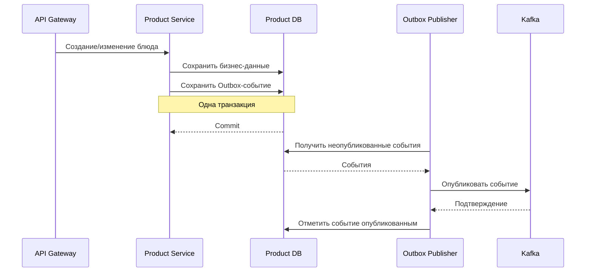
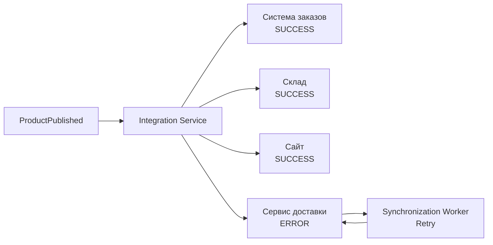
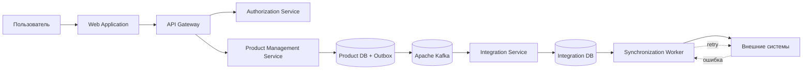

## 8. Архитектура проекта

### 8.1. Общий архитектурный подход

New Product Intro System проектируется как отдельная подсистема ИТ-ландшафта
сети закусочных «Замысловатость».

Система автоматизирует жизненный цикл ввода нового блюда: от создания карточки
и заполнения рецептуры до согласования, публикации и передачи данных в
корпоративные и внешние информационные системы.

Для решения выбрана **микросервисная архитектура** с сочетанием:

- синхронного REST-взаимодействия;
- асинхронного событийного взаимодействия;
- Apache Kafka в качестве Event Bus;
- отдельных баз данных для сервисов;
- API Gateway как единой точки входа;
- централизованной проверки полномочий;
- Transactional Outbox для надёжной публикации событий;
- специализированного Integration Service;
- хранения состояния интеграционных операций;
- retry-механизмов;
- мониторинга и логирования.

Ключевой архитектурный принцип решения — разделение бизнес-функций между
независимыми компонентами и минимизация прямой связанности между системой
управления новым блюдом и внешними информационными системами.

---

## 8.2. Архитектурные цели

Архитектура должна обеспечивать не только реализацию функциональных требований,
но и выполнение качественных характеристик системы.

Основными архитектурными целями являются:

1. обеспечение надёжной обработки данных о новом блюде;
2. исключение потери событий при взаимодействии компонентов;
3. независимость интеграций друг от друга;
4. возможность автоматического восстановления после временных сбоев;
5. возможность подключения новых внешних систем без изменения основной
   бизнес-логики;
6. независимое развитие и масштабирование микросервисов;
7. быстрое выполнение пользовательских операций;
8. централизованный контроль доступа;
9. возможность определить состояние интеграционной операции и причину ошибки;
10. снижение связанности между внутренними и внешними системами.

Наибольший архитектурный приоритет имеют **надёжность** и
**интегрируемость**, поскольку процесс внедрения нового блюда зависит от
корректной передачи данных во множество корпоративных и внешних систем.

---

## 8.3. C4 Model

Для описания архитектуры используется подход **C4 Model**.

Архитектура рассматривается на нескольких уровнях:

- **System Context** — место New Product Intro System в ИТ-ландшафте;
- **Container** — основные сервисы и инфраструктурные компоненты;
- **Component** — внутренняя структура наиболее значимых сервисов.

Такое представление позволяет последовательно перейти от общего контекста
системы к деталям реализации отдельных архитектурных механизмов.

---

## 8.4. C4 System Context

На уровне System Context **New Product Intro System** рассматривается как
единая программная система, с которой взаимодействуют бизнес-пользователи
и существующие информационные системы сети.

### Пользователи системы

Основными пользователями являются:

**Маркетолог**

- инициирует ввод нового блюда;
- создаёт соответствующую задачу;
- предоставляет первоначальную информацию о продукте.

**Шеф-повар**

- формирует описание блюда;
- заполняет рецептуру;
- указывает ингредиенты и характеристики продукта;
- участвует в согласовании.

**Технолог**

- контролирует процесс ввода нового блюда;
- проверяет технологическую информацию;
- отслеживает необходимость привлечения дополнительных ресурсов;
- участвует в согласовании.

### Внешние системы

New Product Intro System взаимодействует с существующим ИТ-ландшафтом,
включающим:

- систему управления складом;
- систему управления производством;
- систему управления заказами;
- систему управления логистикой;
- сайт и мобильное приложение сети;
- систему управления персоналом;
- платёжные системы;
- производственные конвейеры и роботов;
- сервисы доставки;
- социальные сети.

New Product Intro System не заменяет эти системы. Она отвечает за управление
процессом внедрения нового блюда и координацию передачи подготовленной
информации в специализированные системы.

---

## 8.5. C4 Container

На уровне Container New Product Intro System декомпозирована на отдельные
сервисы и инфраструктурные компоненты.

Основными компонентами являются:

| Компонент | Назначение |
|---|---|
| **Web Application** | Пользовательский интерфейс |
| **API Gateway** | Единая точка входа в backend |
| **Authorization Service** | Централизованная проверка полномочий |
| **Product Management Service** | Управление карточкой блюда и рецептурой |
| **Workflow Service** | Управление жизненным циклом и согласованием |
| **Notification Service** | Формирование и доставка уведомлений |
| **Integration Service** | Взаимодействие с корпоративными и внешними системами |
| **Event Bus (Apache Kafka)** | Асинхронный обмен событиями |
| **Monitoring** | Метрики, логи и наблюдаемость |
| **Secrets Management** | Хранение технических секретов и ключей |
| **Backup Storage** | Резервное хранение данных |

---

# 8.6. Web Application

**Web Application** является пользовательской точкой взаимодействия с
New Product Intro System.

Через приложение пользователи:

- создают карточки новых блюд;
- заполняют данные;
- работают с рецептурой и ингредиентами;
- выполняют согласования;
- просматривают статусы;
- получают уведомления.

Web Application не обращается непосредственно к бизнес-сервисам.

Все backend-запросы направляются через **API Gateway**.

Такое решение позволяет скрыть внутреннюю структуру микросервисов от клиента
и использовать единую точку взаимодействия с backend.

---

## 8.7. API Gateway

**API Gateway** является единой точкой входа для запросов Web Application.

Основные функции:

- маршрутизация запросов;
- передача запросов соответствующим бизнес-сервисам;
- участие в контроле доступа;
- взаимодействие с Authorization Service;
- сокрытие внутренней топологии микросервисов от клиента.

Использование API Gateway позволяет не реализовывать маршрутизацию и общие
механизмы доступа независимо в каждом клиентском приложении.

---

## 8.8. Аутентификация и авторизация

Архитектура предусматривает централизованную проверку полномочий пользователей.

При выполнении защищённой операции:

1. пользователь предварительно проходит аутентификацию и получает JWT-токен;
2. Web Application передаёт токен вместе с запросом;
3. запрос поступает через API Gateway;
4. выполняется проверка токена и необходимых полномочий пользователя;
5. для проверки прав используется Authorization Service;
6. при наличии необходимых полномочий запрос передаётся бизнес-сервису;
7. при отсутствии необходимых полномочий операция отклоняется.

**Authorization Service** использует собственную **Auth DB** для хранения
информации, необходимой для проверки прав.

Такой подход позволяет централизовать правила авторизации и не реализовывать
независимые механизмы проверки прав в каждом бизнес-сервисе.

> New Product Intro System не выполняет самостоятельную выдачу пользовательской
> идентичности. Authorization Service отвечает именно за проверку полномочий
> в рамках операций системы.

---

# 8.9. Product Management Service

**Product Management Service** является основным бизнес-сервисом системы.

Он отвечает за:

- создание карточки нового блюда;
- изменение карточки;
- хранение основных данных;
- управление рецептурой;
- управление ингредиентами;
- изменение характеристик продукта;
- публикацию событий об изменении блюда.

Описание REST API:

- [`Product Management API (OpenAPI 3.0)`](../API/product-management-api.yaml)

Product Management Service имеет собственную **Product DB**.

Другие микросервисы не должны напрямую изменять данные Product DB.

Это обеспечивает принцип владения данными:

> **каждый микросервис самостоятельно владеет своими данными.**

Такой подход уменьшает связанность сервисов и позволяет независимо изменять
структуру хранения данных внутри каждого компонента.

---

## 8.10. Внутренняя структура Product Management Service

Для Product Management Service выполнена дополнительная декомпозиция
на уровне C4 Component.

Основные компоненты:

### Product API Controller

Принимает REST-запросы, поступающие через API Gateway.

Отвечает за передачу команды на выполнение соответствующей бизнес-операции.

### Product Service

Содержит основную бизнес-логику управления карточкой блюда.

Выполняет:

- создание блюда;
- изменение блюда;
- работу с рецептурой;
- работу с ингредиентами;
- формирование бизнес-событий.

### Product Repository

Отвечает за взаимодействие с Product DB.

Через него выполняются операции чтения и записи данных.

### Recipe Generation Service

Используется для получения генеративных предложений по рецепту и может
участвовать в формировании или модерации рецептуры.

### Outbox Publisher

Отвечает за доставку сохранённых событий из Outbox в Apache Kafka.

---

# 8.11. Transactional Outbox

Одной из архитектурно значимых задач является обеспечение согласованности
между изменением бизнес-данных и публикацией события.

Рассмотрим операцию создания нового блюда.

Необходимо выполнить два действия:

1. сохранить карточку блюда в Product DB;
2. опубликовать событие о создании блюда в Kafka.

Если выполнять эти операции независимо, возможна ситуация:

- карточка успешно сохранена;
- при публикации события Kafka временно недоступна;
- событие не опубликовано;
- остальные сервисы не узнают об изменении.

Для устранения этой проблемы используется паттерн
**Transactional Outbox**.

Логика работы:

Бизнес-данные и запись Outbox сохраняются **в рамках одной транзакции**.

После этого Outbox Publisher:

1. получает неопубликованные события;
2. публикует их в Kafka;
3. получает подтверждение;
4. отмечает событие как опубликованное.

Таким образом, временная недоступность Kafka не приводит к потере информации
о выполненной бизнес-операции.

---

# 8.12. Event Bus

Для асинхронного взаимодействия используется **Apache Kafka**.

Kafka выполняет роль Event Bus системы.

Через неё передаются бизнес-события, например:

- `NewProductCreated`;
- `ProductUpdated`;
- `ProductApproved`;
- `ProductPublished`.

Событийная модель позволяет отправителю не ожидать выполнения всех зависимых
операций.

Например, после публикации нового блюда Product Management Service не должен
синхронно ждать:

- обновления склада;
- публикации на сайте;
- обновления системы заказов;
- публикации в сервисах доставки;
- публикации в социальных сетях.

Вместо этого публикуется событие, после чего необходимые действия выполняются
асинхронно.

Преимущества:

- снижение связанности;
- уменьшение времени пользовательской операции;
- независимость потребителей;
- возможность добавлять новые обработчики;
- возможность масштабировать потребителей событий независимо.

---

# 8.13. Workflow Service

**Workflow Service** отвечает за управление жизненным циклом нового блюда.

Он хранит состояние бизнес-процесса в собственной **Workflow DB**.

В его ответственность входит:

- управление статусами;
- определение допустимых переходов;
- назначение задач;
- управление процессом согласования;
- определение текущего этапа;
- фиксация завершения этапов.

Бизнес-логика workflow отделена от Product Management Service.

Это позволяет изменять процесс согласования без необходимости существенно
изменять сервис, отвечающий за данные карточки блюда.

---

# 8.14. Notification Service

**Notification Service** отвечает за формирование и доставку пользовательских
уведомлений.

Сервис получает события, связанные с:

- назначением задачи;
- завершением согласования;
- публикацией блюда;
- изменением статуса.

Для хранения необходимого состояния используется собственная
**Notification DB**.

Для доставки актуальных уведомлений в Web Application используется
**WebSocket**.

Это позволяет обновлять информацию в пользовательском интерфейсе без
постоянного ручного обновления страницы.

---

# 8.15. Integration Service

**Integration Service** является ключевым компонентом интеграционного контура.

Его задача — изолировать бизнес-сервисы New Product Intro System от
особенностей внешних информационных систем.

Product Management Service не должен знать:

- API конкретного сервиса доставки;
- формат складской системы;
- особенности системы заказов;
- правила публикации в социальной сети;
- протокол конкретной внешней системы.

Описание REST API:

- [`Integration API (OpenAPI 3.0)`](../API/integration-api.yaml)

Эта ответственность сосредоточена в Integration Service.

Такое решение обеспечивает принцип:

> **подключение новой внешней системы не должно требовать изменения
> Product Management Service.**

---

## 8.16. Внутренняя структура Integration Service

Integration Service включает следующие компоненты:

### Event Consumer

Подписывается на необходимые события Kafka.

После получения бизнес-события определяет необходимость выполнения
соответствующих интеграционных операций.

### Synchronization Service

На основании события формирует задачи синхронизации.

Например, публикация нового блюда может привести к созданию нескольких
независимых задач:

- передать данные в систему заказов;
- передать данные на склад;
- передать данные в систему логистики;
- обновить сайт;
- обновить сервис доставки;
- сформировать публикацию в социальной сети.

### Integration Task Repository

Обеспечивает сохранение и получение задач синхронизации.

### Integration DB

Integration Service имеет **собственную базу данных**.

В ней хранится состояние интеграционных операций.

Для каждой задачи могут храниться:

- идентификатор;
- целевая система;
- тип операции;
- текущий статус;
- количество попыток;
- результат выполнения;
- информация об ошибке.

### Synchronization Worker

Получает задачи синхронизации и выполняет их.

При временной ошибке задача может быть выполнена повторно.

### External System Client

Инкапсулирует непосредственное взаимодействие с внешними системами и их API.

---

## 8.17. Независимое выполнение интеграций

Одним из важнейших требований является независимость интеграций.

Предположим, новое блюдо необходимо передать одновременно:

- в систему заказов;
- на склад;
- на сайт;
- в сервис доставки.

Если сервис доставки временно недоступен, это **не должно блокировать**
обновление остальных систем.

Поэтому для каждой внешней системы создаётся отдельная задача синхронизации.

Пример:

В результате ошибка одной интеграции локализуется и не останавливает
остальной процесс.

---

# 8.18. Retry-механизм

При временной недоступности внешней системы Integration Service не должен
терять задачу.

Общий сценарий:

1. Synchronization Worker получает задачу;
2. выполняет обращение к внешней системе;
3. при успехе переводит задачу в конечное успешное состояние;
4. при временной ошибке фиксирует ошибку;
5. увеличивает количество попыток;
6. сохраняет состояние в Integration DB;
7. задача становится доступной для повторной обработки;
8. после восстановления внешней системы операция выполняется повторно.

Таким образом, восстановление синхронизации не требует ручного повторного
ввода информации пользователем.

---

# 8.19. Хранение данных

Архитектура следует принципу **Database per Service**.

| Сервис | Хранилище | Назначение |
|---|---|---|
| Product Management Service | **Product DB** | Карточки блюд, рецептура, ингредиенты, Outbox |
| Authorization Service | **Auth DB** | Данные, необходимые для проверки полномочий |
| Workflow Service | **Workflow DB** | Состояния бизнес-процессов и задач |
| Notification Service | **Notification DB** | Состояние уведомлений |
| Integration Service | **Integration DB** | Интеграционные задачи, статусы, попытки и ошибки |

Сервисы не должны напрямую использовать таблицы чужих БД.

Обмен информацией между сервисами выполняется через API или события.

Это позволяет:

- уменьшить связанность;
- независимо изменять схемы данных;
- независимо масштабировать сервисы;
- локализовать ответственность за данные.

---

# 8.20. Monitoring и наблюдаемость

Наблюдаемость является отдельным качественным атрибутом системы.

Архитектура предусматривает централизованный сбор:

- метрик;
- логов;
- информации об ошибках;
- состояния интеграционных операций.

Для каждой задачи синхронизации должен быть доступен текущий статус.

Целевые состояния задачи:

- создана;
- выполняется;
- выполнена;
- ошибка.

Для ошибок должна быть доступна информация о причине и этапе возникновения.

Это необходимо как для эксплуатации, так и для контроля автоматического
восстановления интеграций.

---

# 8.21. Secrets Management

Технические секреты не должны храниться непосредственно в исходном коде
микросервисов.

Для этого архитектурой предусмотрен отдельный **Secrets Management**.

В нём могут храниться:

- API-ключи;
- технические токены;
- пароли сервисных пользователей;
- параметры подключения, содержащие секреты.

Такое решение отделяет управление секретами от бизнес-логики приложений.

---

# 8.22. Резервное копирование

Для защиты данных предусматривается резервное копирование баз данных.

На Container-диаграмме выделен **Backup Storage**, предназначенный для
хранения резервных копий.

Механизм резервного копирования является частью обеспечения надёжности
системы и позволяет восстановить состояние после критических сбоев хранения
данных.

---

# 8.23. Нефункциональные требования

Архитектурные требования были дополнительно проанализированы методом
**ATAM (Architecture Tradeoff Analysis Method)**.

В рамках ATAM были определены следующие основные атрибуты качества:

| Атрибут | Приоритет | Архитектурное значение |
|---|---|---|
| **Надёжность** | Очень высокий | Отказы компонентов не должны останавливать процесс публикации; необходимы восстановление и повторная обработка |
| **Интегрируемость** | Очень высокий | Необходимо подключать большое количество корпоративных и внешних систем с минимальным влиянием на существующую архитектуру |
| **Производительность** | Высокий | Пользовательские операции должны выполняться быстро независимо от фоновых интеграционных процессов |
| **Масштабируемость** | Высокий | Система должна поддерживать рост количества ресторанов, пользователей и внешних систем |
| **Безопасность** | Высокий | Операции доступны только пользователям с необходимыми полномочиями |
| **Сопровождаемость** | Средний | Микросервисы должны иметь возможность развиваться независимо |
| **Наблюдаемость** | Средний | Необходимо отслеживать интеграционные задачи, статусы и причины ошибок |

---

## 8.24. Производительность

Для производительности определены следующие требования:

- создание карточки нового блюда должно занимать **не более 3 секунд**;
- одновременная работа нескольких пользователей не должна приводить к
  заметной деградации;
- Kafka не должна создавать значительных задержек при передаче событий;
- при параллельной публикации нескольких блюд нагрузка должна корректно
  распределяться между сервисами.

Для массового сценария установлена отдельная метрика:

> система должна обрабатывать **не менее 100 карточек блюд за 5 минут**
> без деградации производительности.

Для снижения времени пользовательских операций интеграционное взаимодействие
с внешними системами вынесено в асинхронный процесс.

---

## 8.25. Надёжность

Надёжность является одним из наиболее приоритетных атрибутов архитектуры.

Основные требования:

- отказ одного экземпляра сервиса не должен приводить к потере данных;
- временная недоступность внешней системы не должна приводить к потере
  интеграционной задачи;
- после восстановления внешней системы синхронизация должна выполняться
  автоматически;
- после восстановления Kafka необработанные события должны быть доставлены;
- интеграционные задачи должны переходить в конечное состояние;
- сохранённые бизнес-операции не должны теряться при ошибке публикации события.

Для выполнения требований используются:

- Transactional Outbox;
- Integration DB;
- хранение состояния синхронизаций;
- Synchronization Worker;
- retry;
- Kafka;
- резервное копирование.

---

## 8.26. Интегрируемость

Интегрируемость имеет **очень высокий приоритет**.

Система взаимодействует с большим количеством корпоративных и внешних
сервисов, поэтому архитектура должна предотвращать сильную связанность.

Основные требования:

- отказ одной внешней системы не блокирует остальные;
- новая интеграция не требует изменения Product Management Service;
- особенности внешних API локализуются в Integration Service;
- задачи синхронизации отслеживаются независимо.

Целевой сценарий:

> при отказе одной внешней системы синхронизация с остальными доступными
> системами завершается успешно.

---

## 8.27. Масштабируемость

Архитектура должна поддерживать рост:

- количества ресторанов;
- количества пользователей;
- количества одновременно создаваемых блюд;
- количества внешних интеграций;
- количества событий.

Микросервисная архитектура позволяет масштабировать наиболее нагруженные
компоненты независимо.

Для сценария увеличения числа ресторанов установлено требование:

> при увеличении нагрузки в 2 раза время обработки не должно увеличиваться
> более чем на 30%.

---

## 8.28. Безопасность

Основные требования безопасности:

- только авторизованные сотрудники могут выполнять операции;
- права пользователя проверяются перед выполнением защищённой операции;
- используется Authorization Service;
- при отсутствии необходимого права операция отклоняется;
- конфиденциальные данные не передаются между компонентами в открытом виде;
- действия пользователей должны быть доступны для аудита.

Для проверки полномочий определена метрика:

> время проверки JWT-токена и прав пользователя не должно превышать
> **500 мс**.

---

## 8.29. Сопровождаемость

Архитектура должна позволять независимо изменять отдельные компоненты.

Основные требования:

- добавление внешней системы локализуется в Integration Service;
- изменение процесса согласования локализуется преимущественно в Workflow Service;
- обновление одного микросервиса не требует изменения остальных;
- каждый сервис владеет собственной БД;
- интеграционные контракты отделены от основной бизнес-логики.

Это снижает стоимость дальнейшего развития системы.

---

## 8.30. Наблюдаемость

Для эксплуатации необходимо иметь возможность определить текущее состояние
системы без анализа её внутреннего состояния вручную.

Требования:

- **100% задач синхронизации** имеют текущий статус;
- для **100% ошибок** доступна информация о причине и этапе возникновения;
- ошибки интеграций регистрируются;
- оператор может определить состояние конкретной синхронизации;
- состояние retry доступно для анализа.

---

# 8.31. Приоритетные сценарии качества ATAM

В рамках ATAM наиболее высокий приоритет получили сценарии, связанные
с надёжностью и интеграциями.

| Сценарий | Метрика | Атрибут | Приоритет |
|---|---|---|---:|
| Создание нового блюда | ≤ 3 секунд | Производительность / сопровождаемость | 15 |
| Публикация нового блюда | Все системы получают данные ≤ 1 минуты | Производительность / интегрируемость | **25** |
| Недоступность внешней системы | Автоматическая синхронизация после восстановления | Надёжность | **25** |
| Массовое создание | ≥ 100 карточек за 5 минут | Производительность / масштабируемость | 9 |
| Добавление сервиса доставки | Изменения локализованы в одном сервисе | Сопровождаемость / масштабируемость | 12 |
| Проверка полномочий | ≤ 500 мс | Безопасность | 10 |
| Потеря сообщения при синхронизации | Ни одно событие не теряется | Надёжность / наблюдаемость | **25** |
| Новая внешняя система | Изменяется Integration Service и адаптер | Сопровождаемость | 12 |
| Обновление микросервиса | Остальные сервисы не требуют остановки или изменения | Сопровождаемость | 12 |
| Ошибка внешней системы | Остальные интеграции завершаются успешно | Интегрируемость | **25** |
| Новая интеграция | Product Management Service не изменяется | Интегрируемость | 12 |
| Статус задачи | 100% задач имеют статус | Наблюдаемость | 15 |
| Причина ошибки | Для 100% ошибок доступна причина | Наблюдаемость | 12 |

Таким образом, наиболее критичными для архитектуры являются сценарии,
связанные с:

- публикацией нового блюда;
- недоступностью внешних систем;
- предотвращением потери интеграционных операций;
- независимостью внешних интеграций.

---

# 8.32. Архитектурные компромиссы

ATAM показал, что выбранные архитектурные решения имеют не только преимущества,
но и связанные с ними trade-offs.

### Компромисс 1. Производительность ↔ Надёжность

Для уменьшения времени пользовательских операций применяется событийное
взаимодействие через Kafka.

Пользовательская операция может завершиться без ожидания выполнения всех
внешних интеграций.

Преимущество:

- повышение скорости пользовательских операций;
- независимость от времени ответа внешних систем.

Недостаток:

- появляется риск временного рассогласования состояния.

Для компенсации используются:

- Integration DB;
- хранение состояния синхронизаций;
- Synchronization Worker;
- повторная обработка.

---

### Компромисс 2. Масштабируемость ↔ Сложность сопровождения

Микросервисная архитектура позволяет независимо масштабировать компоненты.

Однако увеличение количества сервисов повышает эксплуатационную сложность:

- увеличивается количество развертываемых компонентов;
- усложняется диагностика;
- появляется больше сетевых взаимодействий;
- увеличивается количество контрактов.

Для уменьшения сложности используются:

- единый API Gateway;
- централизованная авторизация;
- унифицированные события Kafka;
- мониторинг и логирование.

---

### Компромисс 3. Интегрируемость ↔ Время доставки данных

Интеграции выполняются независимо.

Это означает, что при недоступности одной системы остальные продолжают
получать информацию.

Преимущество:

- отказ одной системы не блокирует весь процесс.

Компромисс:

- данные могут появляться в разных системах в разное время;
- возникает временная eventual consistency.

Для управления этим состоянием Integration Service:

- хранит отдельную задачу для каждой интеграции;
- хранит её статус;
- фиксирует ошибки;
- выполняет повторные попытки только для неуспешных операций.

---

# 8.33. Связь НФТ и архитектурных решений

Архитектурные компоненты введены не произвольно, а являются следствием
нефункциональных требований и результатов ATAM.

| НФТ / проблема | Архитектурное решение |
|---|---|
| Пользователь не должен ждать внешние системы | Kafka и асинхронная обработка |
| Событие не должно теряться после сохранения блюда | Transactional Outbox |
| Ошибка внешней системы не должна блокировать остальные | Независимые Integration Tasks |
| Неуспешная интеграция должна восстановиться автоматически | Synchronization Worker + retry |
| Необходимо знать состояние каждой интеграции | Integration DB |
| Новая интеграция не должна изменять Product Management | Integration Service |
| Изменение workflow не должно затрагивать остальные сервисы | Workflow Service |
| Необходима централизованная проверка прав | API Gateway + Authorization Service |
| Сервисы должны развиваться независимо | Database per Service |
| Необходимо диагностировать сбои | Monitoring + логи + статусы |
| Необходимо защитить технические секреты | Secrets Management |
| Необходимо восстановление данных | Backup Storage |

Таким образом, архитектура формировалась на основании конкретных
качественных требований, а не только функциональной декомпозиции системы.

---

# 8.34. Итоговая архитектурная цепочка

Упрощённо обработку ключевого сценария можно представить следующим образом:

Основной принцип обработки:

**пользовательская операция → сохранение бизнес-данных → надёжная публикация
события → создание независимых интеграционных задач → выполнение синхронизации
→ контроль состояния → повторная обработка при необходимости.**

---

# 8.35. Итог архитектурного решения

Выбранная архитектура обеспечивает разделение системы на компоненты с
ограниченными зонами ответственности.

**Product Management Service** управляет данными блюда.

**Workflow Service** управляет бизнес-процессом.

**Notification Service** отвечает за уведомления.

**Authorization Service** централизует проверку полномочий.

**Integration Service** изолирует основную бизнес-логику от внешних систем.

**Apache Kafka** обеспечивает событийное взаимодействие.

**Transactional Outbox** снижает риск потери событий между сохранением
бизнес-данных и их публикацией.

**Integration DB и Synchronization Worker** обеспечивают хранение состояния,
повторную обработку и восстановление интеграций.

**Monitoring** обеспечивает наблюдаемость.

**Database per Service** обеспечивает независимость данных микросервисов.

В совокупности эти решения направлены на выполнение наиболее значимых
качественных атрибутов, выявленных в ходе ATAM:

**надёжности, интегрируемости, производительности, масштабируемости,
безопасности, сопровождаемости и наблюдаемости.**