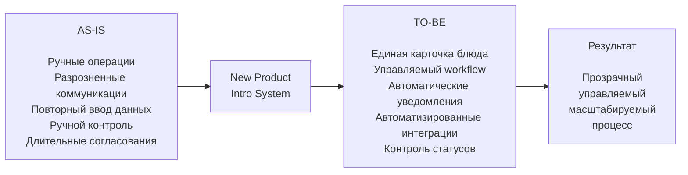

## 9. Заключение

В рамках проекта разработано решение по автоматизации процесса ввода новых блюд в сети закусочных **«Замысловатость»** — **New Product Intro System**.

Необходимость реализации проекта обусловлена недостатками существующего процесса: большим количеством ручных операций и согласований, использованием разрозненных каналов коммуникации, повторным вводом данных, сложностью контроля текущего состояния процесса и необходимостью вручную передавать информацию о новом блюде в корпоративные и внешние информационные системы.

Предлагаемое решение формирует **единый цифровой контур управления процессом ввода нового блюда**.

New Product Intro System обеспечивает:

- создание и ведение единой карточки нового блюда;
- хранение информации о рецептуре, ингредиентах и характеристиках продукта;
- управление жизненным циклом блюда;
- организацию процесса согласования;
- назначение задач участникам процесса;
- отслеживание текущего статуса внедрения;
- автоматическое уведомление пользователей о значимых событиях;
- автоматизированную передачу информации в корпоративные и внешние системы;
- контроль состояния интеграционных операций;
- повторное выполнение операций при временной недоступности внешних систем.

Таким образом, система позволяет перейти от разрозненного процесса, основанного преимущественно на ручном взаимодействии между подразделениями, к **централизованному, прозрачному и управляемому процессу**.

### 9.1. Результаты проектирования

В ходе проектирования решения были выполнены следующие ключевые работы:

1. Проанализирован существующий процесс ввода нового блюда и определены его основные проблемы.
2. Сформированы цели автоматизации и целевое состояние процесса.
3. Определены функциональные и нефункциональные требования.
4. Разработана целевая архитектура New Product Intro System.
5. Определены границы системы и её взаимодействие с существующим ИТ-ландшафтом.
6. Выполнена декомпозиция решения на сервисы и инфраструктурные компоненты.
7. Спроектировано событийное взаимодействие через **Apache Kafka**.
8. Для надёжной публикации бизнес-событий выбран паттерн **Transactional Outbox**.
9. Интеграционное взаимодействие вынесено в отдельный **Integration Service**.
10. Предусмотрено хранение состояния интеграционных операций и механизм их повторного выполнения.
11. Определён подход к управлению жизненным циклом блюда через **Workflow Service**.
12. Предусмотрены централизованная авторизация, мониторинг, логирование, управление секретами и резервное копирование.
13. Архитектурные решения проанализированы с использованием **ATAM** с учётом нефункциональных требований и архитектурных компромиссов.
14. Сформирован детальный Roadmap реализации проекта.
15. Определён состав кросс-функциональной проектной команды.
16. Проведена оценка проектных рисков и определены мероприятия по их снижению.

---

### 9.2. Соответствие решения поставленным целям

Разработанное решение непосредственно связано с целями проекта.

| Цель проекта | Результат выбранного решения |
|---|---|
| Сократить количество ручных операций | Передача данных и часть действий автоматизируются |
| Создать единый источник информации | Используется централизованная карточка нового блюда |
| Повысить прозрачность процесса | Система хранит текущие состояния и позволяет отслеживать статус внедрения |
| Сократить ручные коммуникации | Используются задачи, workflow и автоматические уведомления |
| Автоматизировать взаимодействие с ИС | Реализуется централизованный интеграционный контур |
| Повысить надёжность передачи данных | Используются Kafka, Transactional Outbox, хранение состояния и retry |
| Исключить блокировку всего процесса одной внешней системой | Интеграционные операции выполняются независимо |
| Обеспечить дальнейшее развитие решения | Используется модульная микросервисная архитектура |

Таким образом, архитектурное и функциональное решение соответствует исходным целям проекта и направлено на устранение выявленных проблем существующего процесса.

---

### 9.3. Ожидаемый эффект

Внедрение New Product Intro System должно обеспечить качественное изменение процесса ввода новых блюд.

Основные ожидаемые эффекты:

- сокращение количества ручных операций;
- уменьшение количества повторного ввода информации;
- сокращение времени передачи данных между подразделениями;
- повышение прозрачности процесса;
- снижение вероятности потери или искажения информации;
- повышение контролируемости согласований;
- автоматизация взаимодействия с существующими информационными системами;
- снижение зависимости процесса от ручных коммуникаций;
- повышение наблюдаемости интеграционных операций;
- упрощение подключения новых внешних систем в дальнейшем.

Ключевой результат проекта заключается не только в создании новой информационной системы, но и в **изменении самого подхода к управлению процессом ввода нового блюда**.

Вместо последовательной передачи информации между участниками и системами формируется единый управляемый процесс, в котором информация создаётся один раз, последовательно обогащается и после выполнения необходимых согласований автоматически распространяется в связанные системы.

---

### 9.4. Реализуемость проекта

Реализация проекта запланирована на период:

**15.05.2026–29.11.2026.**

Срок определён на основании детальной декомпозиции работ по направлениям:

- аналитика;
- архитектура;
- UX/UI;
- backend-разработка;
- frontend-разработка;
- интеграции;
- тестирование;
- инфраструктура;
- внедрение.

Работы организованы с учётом зависимостей и возможности параллельного выполнения независимых задач.

Для реализации сформирована кросс-функциональная команда, включающая аналитиков, архитектора, разработчиков, UX/UI-дизайнера, QA-инженера, DevOps-инженера и администратора баз данных.

Проектные риски выявлены и классифицированы заранее. Для наиболее значимых рисков предусмотрены превентивные мероприятия и механизмы реагирования.

Это позволяет рассматривать сформированный Roadmap как обоснованный план реализации решения с учётом архитектурной сложности, ресурсных ограничений, интеграционных зависимостей и необходимого объёма тестирования.

---

### 9.5. Итог проекта

Итогом проекта должен стать промышленный запуск **New Product Intro System** — единой платформы управления процессом ввода новых блюд в сети закусочных «Замысловатость».

Целевое изменение процесса можно представить следующим образом:

В результате New Product Intro System становится центральным элементом процесса, связывающим участников бизнеса и существующие информационные системы и обеспечивающим управление жизненным циклом нового блюда от момента его создания до промышленного внедрения.

Проект создаёт основу не только для автоматизации текущего процесса, но и для его дальнейшего развития: подключения новых внешних систем, изменения процессов согласования, масштабирования решения и расширения функциональности без необходимости перестраивать весь существующий ИТ-ландшафт.

### 9.6. Личные итоги и точки роста

Работа над проектом позволила пройти полный цикл проектирования ИТ-решения — от анализа бизнес-процесса и формирования требований до планирования реализации, оценки рисков и проектирования архитектуры. Наиболее интересной и одновременно наиболее сложной частью для меня стала **проработка архитектуры и нефункциональных требований**. Особенно полезной оказалась работа с ATAM, которая помогла увидеть взаимосвязь между требованиями к качеству системы, архитектурными решениями и возникающими компромиссами. В процессе работы стало понятнее, почему в архитектуре появляются такие решения, как Kafka, Transactional Outbox, Integration Service, retry-механизмы и Database per Service, и какие требования они позволяют обеспечить.

По итогам проекта своей основной точкой роста я считаю дальнейшее развитие компетенций в области **архитектуры информационных систем и работы с НФТ**. Для моей работы системным аналитиком важно не только уметь описывать функциональные требования и взаимодействие компонентов, но и понимать влияние требований на архитектуру, участвовать в выборе технических решений, оценивать их преимущества, ограничения и риски и аргументированно обсуждать их с архитекторами и разработчиками. Именно это направление стало для меня наиболее интересным в проекте и является приоритетным для дальнейшего профессионального развития.